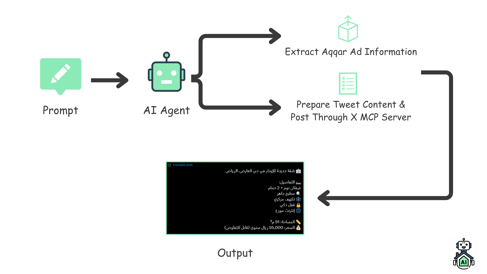

  

  <h1>🐦 Tweet Ad Generation</h1>
  <h3>Autonomous AI Agent for Real Estate Social Media Posting</h3>

## ❓ Why?
In today’s real estate landscape, **social media presence** is key to engaging clients and showcasing listings effectively.  
However, creating and posting tweets manually can be **time-consuming**, repetitive, and inconsistent.

💡 **Solution:**  
The **Tweet Ad Generation Agent** automates the process of crafting and publishing real estate ads on **X (formerly Twitter)**.  
It generates professional, engaging tweet content — directly from property data — and posts it autonomously through an **X MCP Server**.

## 🧠 How It Works
The workflow follows this simple yet powerful pipeline 👇
1. ✏️ **Prompt** – The agent receives a prompt to create a new tweet ad (Tone,Style,etc.).  
2. 🤖 **AI Agents** – The intelligent agents handle the automation flow:
   - Extracts property and ad information from Aqqar Ad.  
   - Prepares a tweet caption and accompanying media.  
   - Posts automatically through the **X MCP Server**.  
3. 🏡 **Output** – The ad is posted on the company’s **X account**, ready for engagement.

## 💻 Code
In the process of finalizing the code...